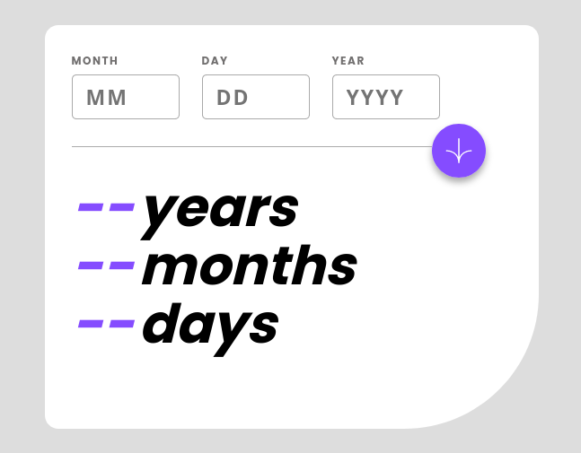

# Frontend Mentor - Age Calculator solution

This is a solution to the [Interactive pricing component challenge on Frontend Mentor](https://www.frontendmentor.io/challenges/age-calculator-app-dF9DFFpj-Q). Frontend Mentor challenges help you improve your coding skills by building realistic projects. 

## Table of contents

- [Overview](#overview)
  - [The challenge](#the-challenge)
  - [Screenshot](#screenshot)
  - [Links](#links)
  - [Built with](#built-with)
  - [What I learned](#what-i-learned)
- [Author](#author)

## Overview

This application is an age calculator that would be used to show a user the days/months/and years since the date inputted when the user inputs a date. This app has interactive elements that make the application feel smoother when user interacts with it.

### The challenge

Users should be able to:

- View an age in years, months, and days after submitting a valid date through the form
- Receive validation errors if:
  - Any field is empty when the form is submitted
  - The day number is not between 1-31
  - The month number is not between 1-12
  - The year is in the future
  - The date is invalid e.g. 31/04/1991 (there are 30 days in April)
- View the optimal layout for the interface depending on their device's screen size
- See hover and focus states for all interactive elements on the page
- **Bonus**: See the age numbers animate to their final number when the form is submitted### Screenshot

### Links

- Live Site URL: [Live Site](https://chris-base.github.io/Age-calculator-app/)
- Solution URL: [My Solution](https://www.frontendmentor.io/solutions/age-calculator-christopher-base-Gs12e5KztM)

### Built with

- Semantic HTML5 markup
- CSS custom properties
- Flexbox
- CSS Grid
- Mobile-first workflow
- JavaScript

### What I learned

I learned a lot about using Browserify to be able to use require, which was then used for moment.js. Moment is an easier date/time npm package, that allows for better use of reading time and dates, as well as comparing them.

## Author

- Website - [Chris Base](https://github.com/chris-base)
- Frontend Mentor - [@chris-base](https://www.frontendmentor.io/profile/chris-base)
